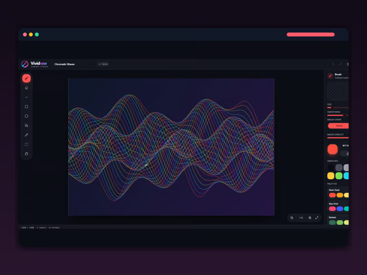

# Chroma Canvas — Next.js

**Live demo:** [vivid-draw.vercel.app](https://vivid-draw.vercel.app)



## Stack

- Next.js 16 (App Router), React 19, TypeScript
- HTML Canvas API for drawing, `localStorage` for persistence
- Tailwind CSS v4 with Radix UI primitives (dialogs, popovers, sliders, tooltips) and class-variance-authority
- Motion for animations, Sonner for toasts, Lucide icons

## Local development

```bash
npm install
npm run dev
```

The application stores drawings in the browser with `localStorage`; no backend or database is required for the current single-device portfolio version.
